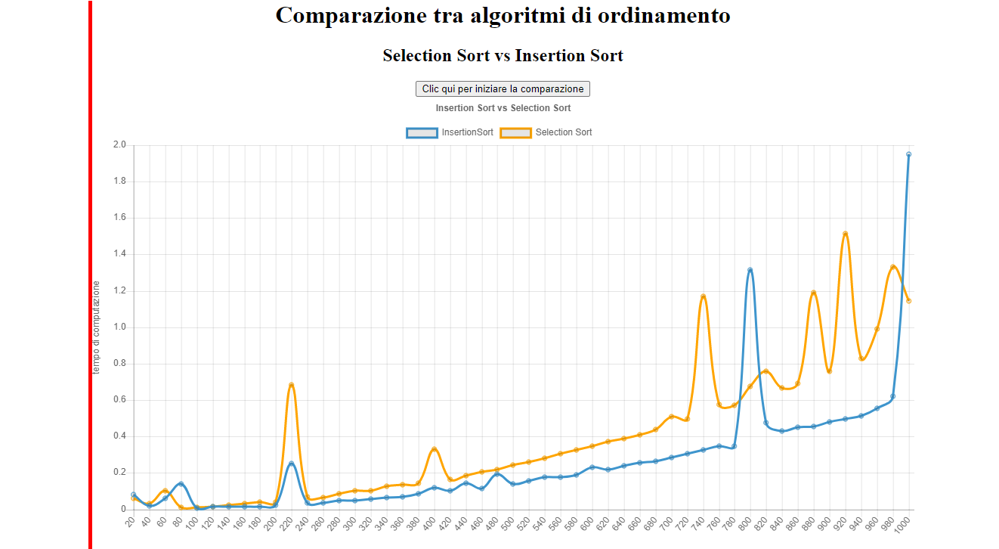

# comparazione algoritmi
Insertion Sort vs Selection Sort

Se *n* è la grandezza dell'input si ha che 
* SELECTION SORT
  * caso peggiore = O(n*n)
  * caso medio = O(n*n)
  * caso migliore = O(n*n)
* INSERTION SORT
  * caso peggiore = O(n*n)
  * caso medio = O(n*n)
  * caso migliore = O(n)
  
 <b>Approfondimento disponibile su Github [qui](https://github.com/mariocuomo/Algoritmi-e-strutture-di-dati/tree/master/ordinamenti)</b>.
 
 <b>Approfondimento disponibile su Amazon [qui](https://www.amazon.it/dp/B085KMGMPQ/)</b>.
